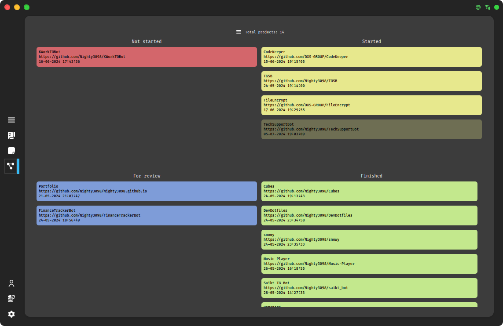
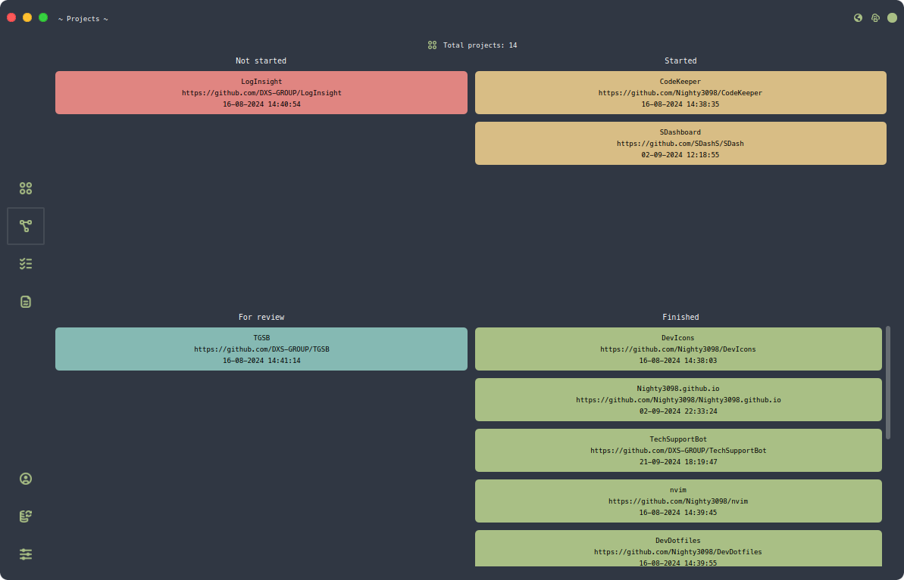

<div class="header" align="center">
    <h1 align="center">CodeKeeper</h1>
    <h3 align="center">Projects manager for developers</h3>
    <br><br>    
    
    <br><br>
</div>

<br><br>
    <div align="center">
    <a href="./LICENSE.md"></a><br>
    <br>
    
    
    
    
    
    
    
    
    
    <br><br><br>
    
    
    
    
    
    
    
    <br><br>
    <h3>Developers:</h3>
    <p align="center">
        <a href = "https://github.com/iinsertNameHere/catnap/graphs/contributors">
            
        </a>
    </p>
    <br>
    <a href="https://github.com/Nighty3098/CodeKeeper/issues/132">Official Project Roadmap</a>
    <br>
    <h3>If you have found bugs in our product or have suggestions, please write about them:</h3>
    <a href="https://t.me/DXS_TechSupport_bot"></a>
</div>

<br><br>

<details>
  <summary align="center">Install CodeKeeper:</summary>
  <br>
  
  ```
  git clone https://github.com/Nighty3098/CodeKeeper --recurse-submodules 
  cd CodeKeeper/src/CodeKeeper
  qmake CodeKeeper.pro
  make
  ```

</details>
<br>

<details align="center">
  <summary align="center">Screenshots:</summary>
  
  
  
  
  <br>
  
  <br>
  
  
</details>

<br>

<details align="center">
<summary align="center">Shortcuts:</summary>
<table align="center">
  <tr>
      <td>Alt+1</td>
      <td>Move to tab 1</td>
  </tr>
  <tr>
    <td>Alt+2</td>
    <td>Move to tab 2</td>
  </tr>
  <tr>
    <td>Alt+3</td>
    <td>Move to tab 3</td>
  </tr>
  <tr>
    <td>Alt+4</td>
    <td>Move to tab 4</td>
  </tr>
  <tr>
    <td>Ctrl+E</td>
    <td>Expand notes list to 1 step</td>
  </tr>
  <tr>
    <td>Ctrl+Shift+P</td>
    <td>Show notes preview</td>
  </tr>
  <tr>
    <td>Ctrl+Shift+L</td>
    <td>Show notes list</td>
  </tr>
  <tr>
    <td>Ctrl+Shift+V</td>
    <td>Toggle view mode</td>
  </tr>
  <tr>
    <td>Ctrl+Shift+N</td>
    <td>Create folder</td>
  </tr>
  <tr>
    <td>Ctrl+N</td>
    <td>Create note</td>
  </tr>
  <tr>
    <td>Ctrl+Del</td>
    <td>Delete note</td>
  </tr>
  <tr>
    <td>F2</td>
    <td>Rename note or folder</td>
  </tr>
  <tr>
    <td>Del</td>
    <td>Remove task or project</td>
  </tr>
  <tr>
    <td>Ctrl+N</td>
    <td>Create new project</td>
  </tr>
  <tr>
    <td>Ctrl+Shift+S</td>
    <td>Open settings</td>
  </tr>
</table>
</details>

<br>
<details align="center">
  <summary align="center">Tweaks:</summary>
  <br>

| Default theme | Custom theme |
|:--------------|:-------------|
|  |  |

</details>

<br>
<details align="center">
  <summary align="center">Stats:</summary>
  <br>
    
</details>


<br><br>
<div align="center">
    <br>
    <h3>Support me with TON</h3>

`UQCF-sPDO0QqkNtvy5CKSvYWEsZS6l7vzaytV36oYM0SNhKt`

<br><br><br>
</div>

