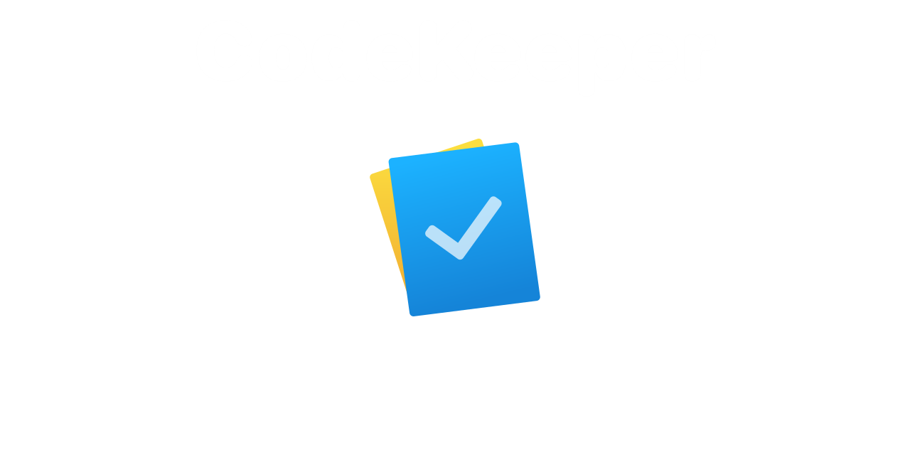

# Notes manager for developers



## Tasks:

  - [ ] - UI
    - [ ] - Context menu for notes
    - [ ] - Context menu for tasks
    - [ ] - Context menu for projects
    - [ ] - Light theme
    - [ ] - Theme swither
    - [ ] - Custom window decorations
    - [ ] - Update project editor window
******
  - [X] - Task movement functionality
  - [X] - Project creation functionality
  - [X] - Note-taking functionality
  - [X] - Task creation functionality
  - [ ] - Update markdown render ( migrate to QWebEngineView )
  - [ ] - Functionality of moving notes
  - [ ] - Multilang
  - [ ] - Fix visual bugs
  - [ ] - Fix notes path bug
******
  - [ ] - Saving data:
    - [X] - Saving notes to MD files
    - [X] - Saving a list of tasks in the DB
    - [ ] - Saving a projects list  in the DB
  ******
  - [ ] - Crossplatform app:
    - [X] - Linux
    - [ ] - Windows
    - [ ] - Mac
  
 
## Installing:

```bash
git clone https://github.com/Nighty3098/CodeKeeper
cd CodeKeeper/src/CodeKeeper
qmake CodeKeeper.pro
make
```

## Screenshots:


