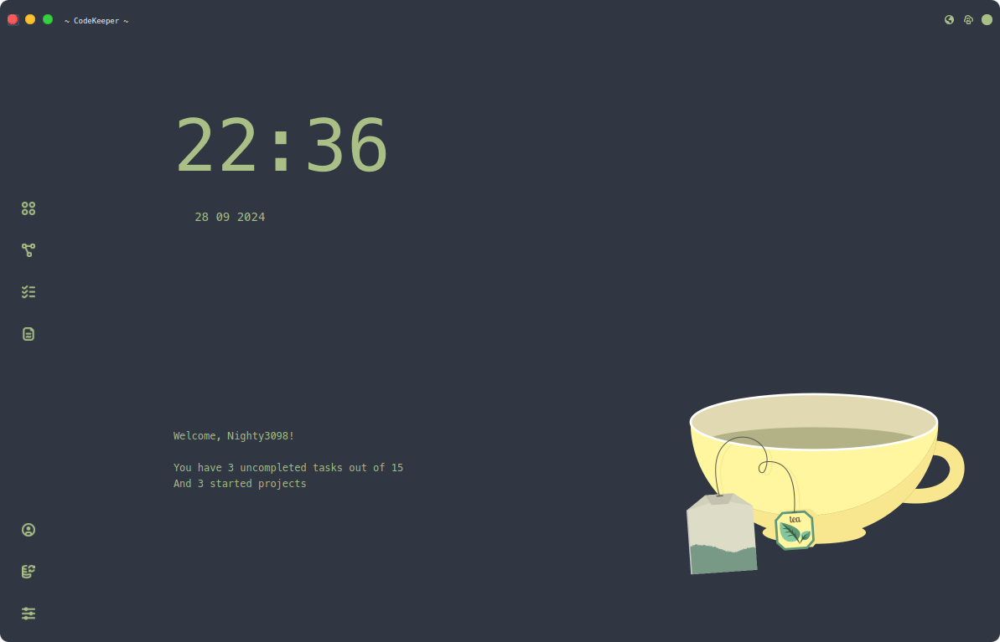
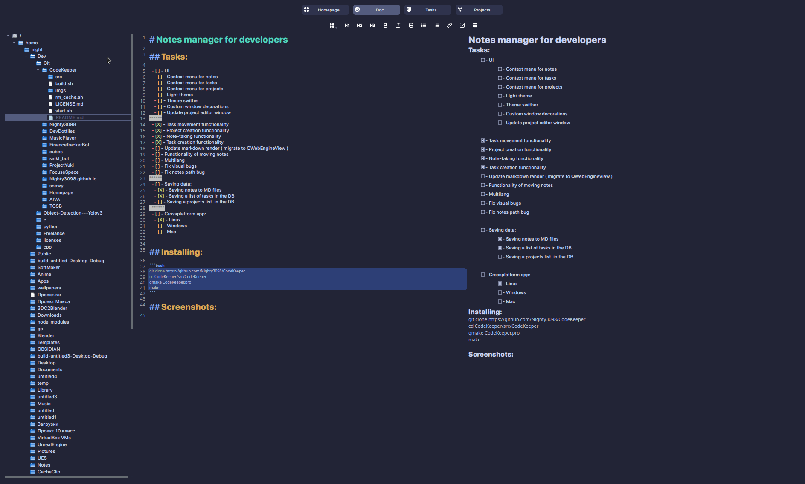
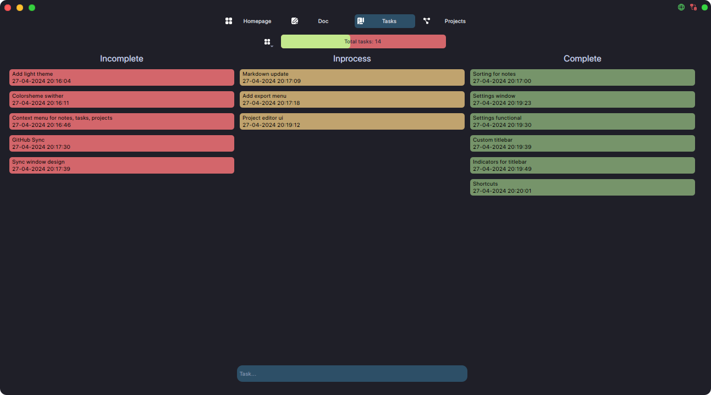
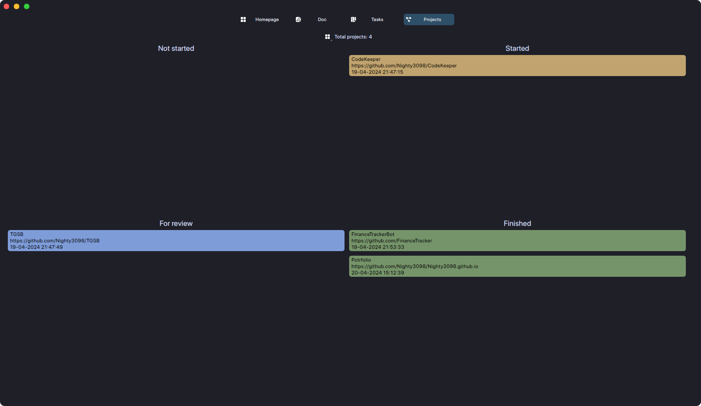

# Notes manager for developers



<div align="center">
<a href="./LICENSE.md"></a>
<br>


<!---->
<br>


<br>
<a href="https://discord.gg/#9707" target="blank"></a>
<a href="https://t.me/Night3098" target="blank"></a>
<a href="mailto:night3098game@gmail.com" target="blank"></a>
</div>

## Tasks:

  - [ ] - UI
    - [X] - Custom window decorations
    - [X] - Update project editor window
    - [ ] - Context menu for notes
    - [ ] - Context menu for tasks
    - [ ] - Context menu for projects
    - [ ] - Light theme
    - [ ] - Theme swither
    - [ ] - Update view mode for markdown
******
  - [X] - Saving data:
    - [X] - Saving notes to MD files
    - [X] - Saving a list of tasks in the DB
    - [X] - Saving a projects list  in the DB
******
  - [ ] - Crossplatform app:
    - [X] - Linux (AppImage)
    - [ ] - Windows (exe)
    - [ ] - Mac
 ******
  - [X] - Task movement functionality
  - [X] - Project creation functionality
  - [X] - Note-taking functionality
  - [X] - Task creation functionality
  - [ ] - Update markdown render ( migrate to QWebEngineView )
  - [ ] - Functionality of moving notes
  - [X] - Fix visual bugs
  - [X] - Fix notes path bug
  - [ ] - Markdown to HTML converter
  - [ ] - Markdown to PDF converter
  - [ ] - Multilang
  - [ ] - Migrate to CMake
 
## Installing:

```bash
git clone https://github.com/Nighty3098/CodeKeeper --recurse-submodules
cd CodeKeeper/src/CodeKeeper
qmake CodeKeeper.pro
make
```

## Screenshots:





