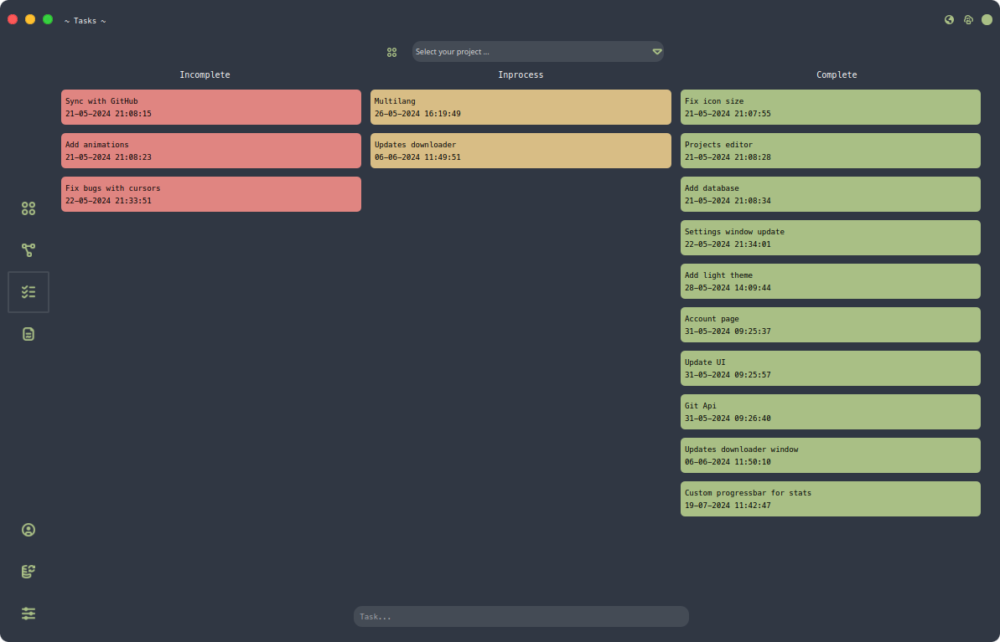

<h1 align="center">CodeKeeper</h1>
<h3 align="center">Notes and projects manager for developers</h3>


<div align="center">
<a href="./LICENSE.md"></a>
<br>


<!---->
<br>


<br>
<a href="https://discord.gg/#9707" target="blank"></a>
<a href="https://t.me/Night3098" target="blank"></a>
<a href="mailto:night3098game@gmail.com" target="blank"></a>
</div>


<details align="center" open>
<summary><h2 align="center">Shortcuts:</h2></summary>
<table align="center">
  <tr>
      <td>Alt+1</td>
      <td>Move to tab 1</td>
  </tr>
  <tr>
    <td>Alt+2</td>
    <td>Move to tab 2</td>
  </tr>
  <tr>
    <td>Alt+3</td>
    <td>Move to tab 3</td>
  </tr>
  <tr>
    <td>Alt+4</td>
    <td>Move to tab 4</td>
  </tr>
  <tr>
    <td>Ctrl+E</td>
    <td>Expand notes list to 1 step</td>
  </tr>
  <tr>
    <td>Ctrl+Shift+P</td>
    <td>Show notes preview</td>
  </tr>
  <tr>
    <td>Ctrl+Shift+L</td>
    <td>Show notes list</td>
  </tr>
  <tr>
    <td>Ctrl+Shift+V</td>
    <td>Toggle view mode</td>
  </tr>
  <tr>
    <td>Ctrl+Shift+N</td>
    <td>Create folder</td>
  </tr>
  <tr>
    <td>Ctrl+N</td>
    <td>Create note</td>
  </tr>
  <tr>
    <td>Ctrl+Del</td>
    <td>Delete note</td>
  </tr>
  <tr>
    <td>F2</td>
    <td>Rename note or folder</td>
  </tr>
  <tr>
    <td>Del</td>
    <td>Remove task or project</td>
  </tr>
  <tr>
    <td>Ctrl+N</td>
    <td>Create new project</td>
  </tr>
  <tr>
    <td>Ctrl+Shift+S</td>
    <td>Open settings</td>
  </tr>
</table>

</details>


<details align="center" open>
  <summary><h2 align="center">Install CodeKeeper:</h2></summary>
  
  ```bash
  git clone https://github.com/Nighty3098/CodeKeeper --recurse-submodules
  cd CodeKeeper/src/CodeKeeper
  qmake CodeKeeper.pro
  make
  ```

</details>


<details align="center">
  <summary><h2 align="center">Screenshots:</h2></summary>

  
  <br />
  <br />
  
  <br />
  <br />
  
  <br />
  <br />
  

</details>


<details>
<summary align="center"><h2 align="center">Tasks:</h2></summary>

  - [X] - Custom window decorations
  - [X] - Update project editor window
  - [ ] - Context menu for notes
  - [ ] - Context menu for tasks
  - [ ] - Context menu for projects
  - [ ] - Light theme
  - [ ] - Theme swither
  - [X] - Update view mode for markdown
******
  - [X] - Saving notes to MD files
  - [X] - Saving a list of tasks in the DB
  - [X] - Saving a projects list  in the DB
******
  - [X] - Linux (AppImage)
  - [ ] - Windows (exe)
  - [ ] - Mac
 ******
  - [X] - Task movement functionality
  - [X] - Project creation functionality
  - [X] - Note-taking functionality
  - [X] - Task creation functionality
  - [X] - Update markdown render ( migrate to QWebEngineView )
  - [X] - Using marked js
  - [X] - Fix visual bugs
  - [X] - Fix notes path bug
  - [ ] - Markdown to HTML converter
  - [ ] - Markdown to PDF converter
  - [ ] - Functionality of moving notes
  - [ ] - Multilang
  - [ ] - Migrate to CMake
  - [ ] - Update shortcuts

</details>
