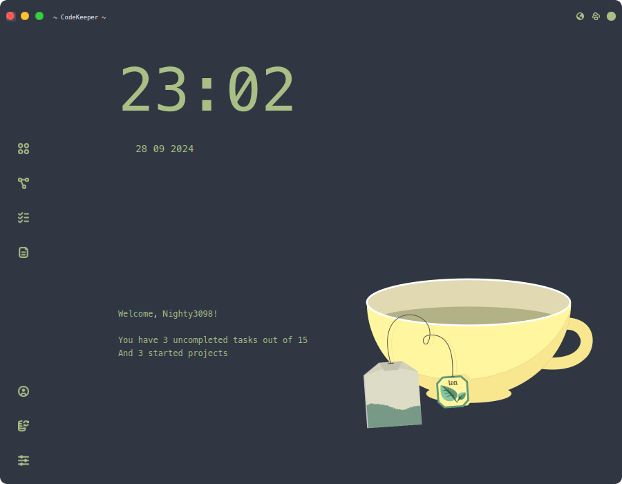
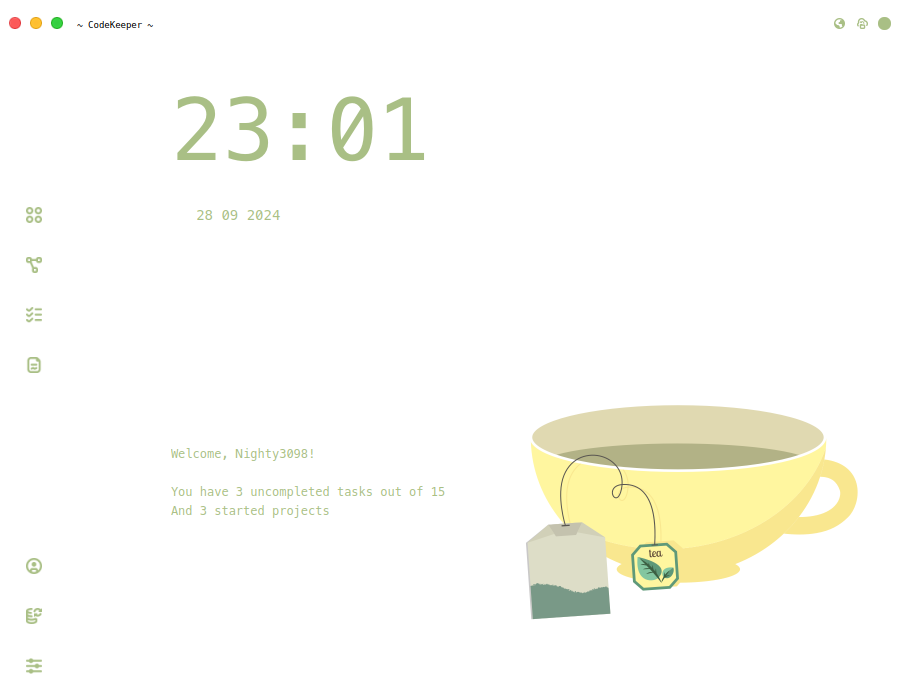

### Tweaks

> [!WARNING]
> On some operating systems there may be problems with the standard qt theme, in this case, we recommend to enable custom theme in the program settings.

| Default theme | Custom theme |
|:--------------|:-------------|
|  |  |

  

| Light theme | Dark theme |
|:--------------|:-------------|
|  |  |
